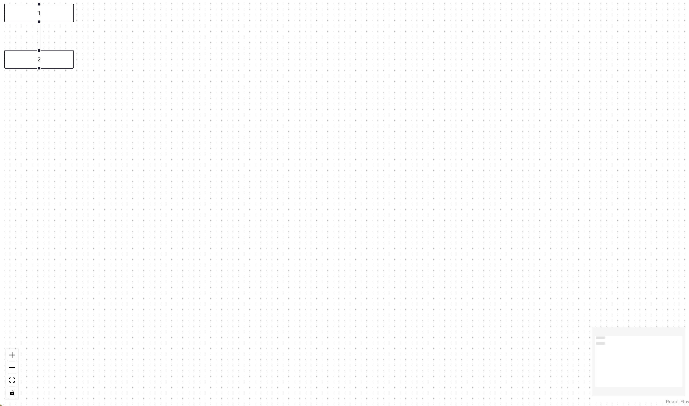

# README
Let's go!

Michael's comment

nora's comment

nora's second comment

## How to Build

```console
cd k9db-visualizer 
npm install
npm run dev
```

For init, you should be able to see the following template:



## Canvas TODO
1. Schema button should have a pop-up window as a text box
2. Validate button should have a pop-up window to display alert message
3. Decompose flow into node and edges
4. Flow should render the node and edges according to the parser result (use fake data at the test stage)