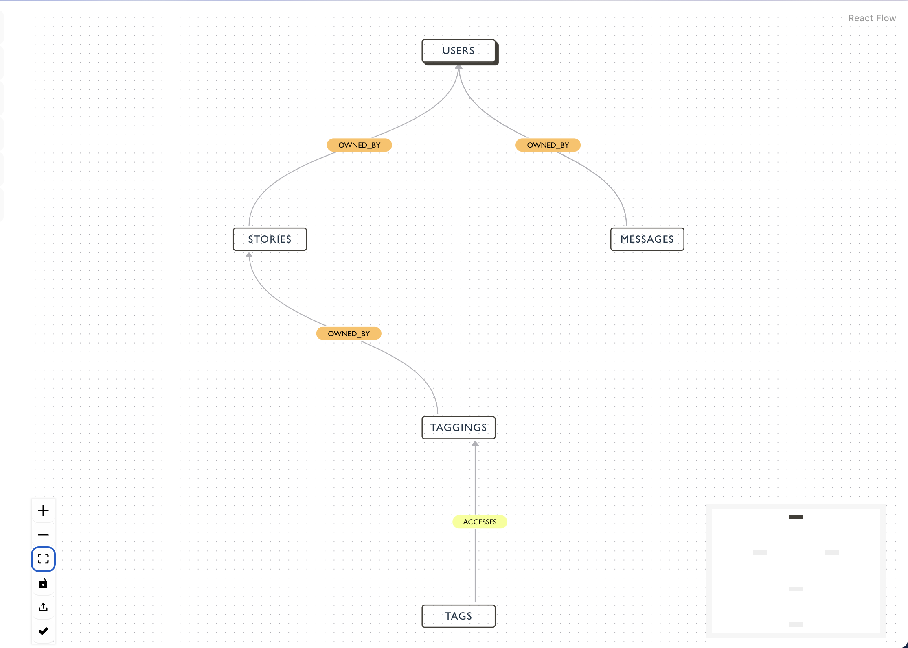

## Live Demo

Click [here](https://mingchao-zhang.github.io/K9db-Visualizer/)

## How to Build Locally

```console
cd k9db-visualizer
npm install
npm run dev
```

For the current phase, you should able to see this page:



## TODO

1. **BUG** : If there's no data subject in the schema, nothing will be rendered. This is probably due to the implementation of splitting the data subjects and non data subjects nodes.
2. **Improv:** Add more heuristics checking (validation)
3. **Improv:** Make the front-end more beautiful
